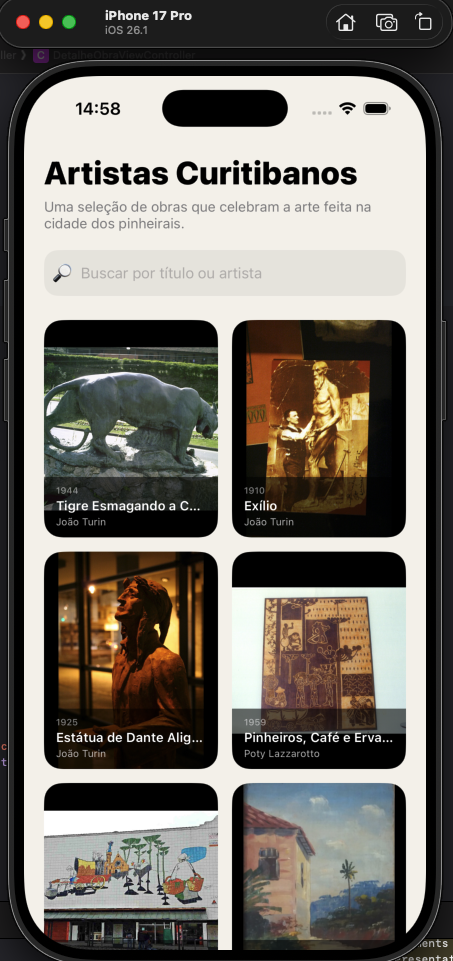
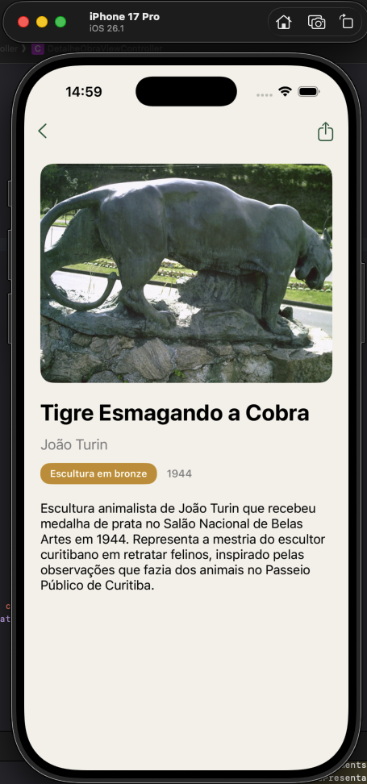
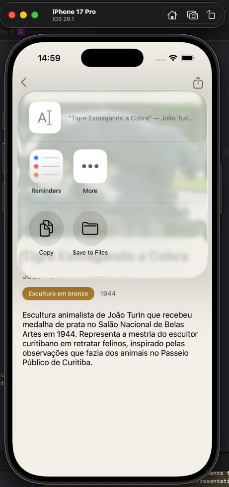
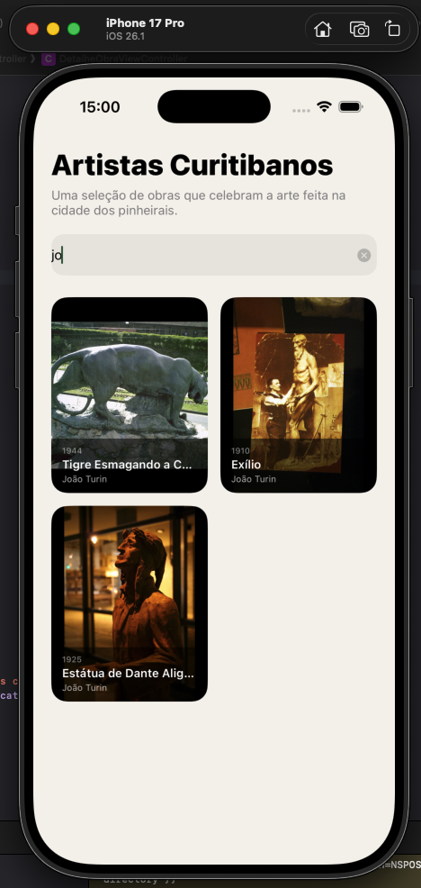
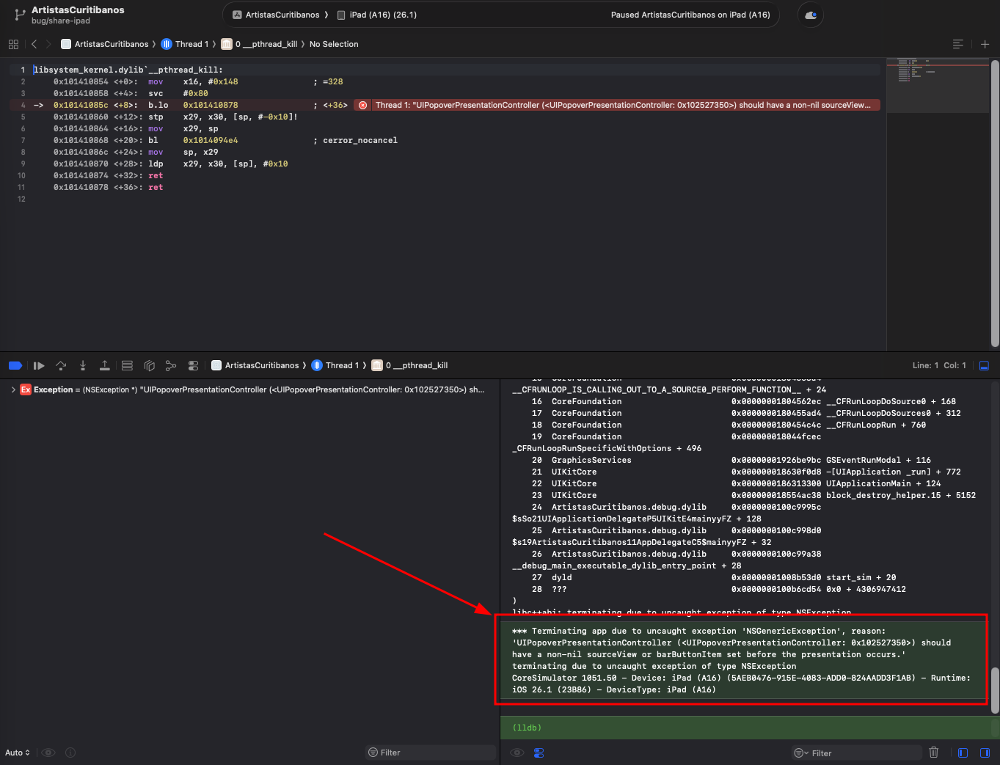
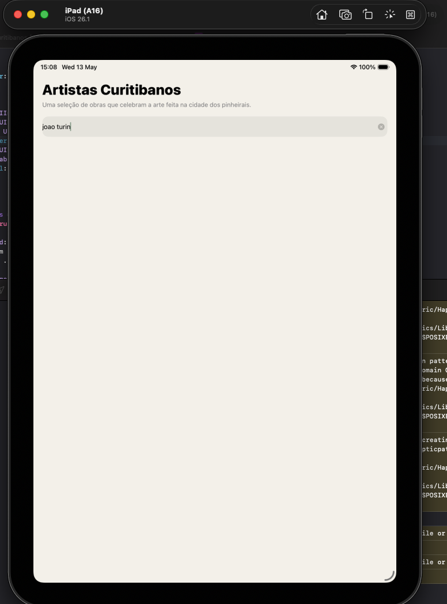
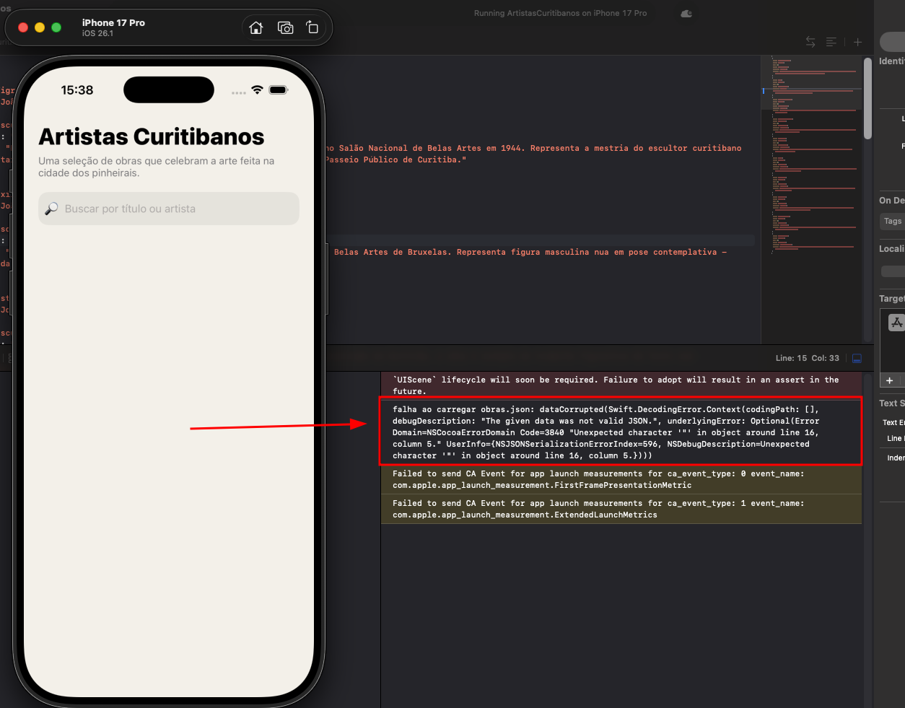

# Integrantes

- Bruno Mazetto
- Gustavo Silveira
- Letícia Fabri
- Rafael Cesar

## Sobre o projeto

App iOS com galeria de obras de artistas de Curitiba (inclui esculturas, pinturas e murais)

Artistas no app:

- João Turin
- Poty Lazzarotto
- Guido Viaro
- Miguel Bakun
- Loio-Pérsio

### Evidência da galeria



## Arquitetura

Usamos MVC, padrão comum em UIKit. A camada de dados ficou separada num repository.

```
Models       -> ObraDeArte (struct Codable)
Views        -> ObraCell (UICollectionViewCell)
Controllers  -> GaleriaViewController, DetalheObraViewController
Data         -> ObraRepository (com cache em memória)
Resources    -> obras.json, Assets.xcassets
```

Escolhemos MVC porque o projeto é pequeno e o UIKit já vem feito pra esse padrão. O `ObraRepository` carrega o JSON uma vez e guarda em memória, assim ninguém precisa reler o arquivo a cada vez que muda de tela.

## Decisões de UI e UX

A paleta tem três cores: verde no fundo das células (pra lembrar araucária), âmbar como destaque (cor do pinhão) e um background bege bem claro pra não usar branco puro. As três estão no Assets Catalog como Color Sets.

A grid tem duas colunas no iPhone e no iPad. As células ficam com a imagem ocupando quase tudo + um rodapé escuro semitransparente com título e artista.

A tela de detalhe usa scroll pois descrições poderiam ser grandes. Em cima a imagem. Embaixo o título, artista, ano, estilo num chip pequeno e a descrição.

O texto que aparece ao compartilhar é `"<título>", de <artista>. Conheça mais artistas curitibanos no app Galeria.`.

### Evidência do detalhe



### Evidência do compartilhamento



## Desafios atendidos

### Animação ao tocar na célula

As células fazem fade-in quando aparecem no scroll. Usamos `collectionView(_:willDisplay:forItemAt:)`, deixando a célula com alpha 0 e animando pra alpha 1 em 0.3 segundos

### Barra de pesquisa

A barra fica no topo da galeria. Conforme o usuário digita, a lista filtra em tempo real por título ou artista. A busca ignora acentos e maiúsculas, então funciona pra "João Turin" ou "joao turin".

### Evidência da busca



## Dificuldades encontradas e como foram solucionadas

### 1. Crash do compartilhamento ao rodar em iPad

#### Problema

Na primeira versão, o botão de compartilhar só criava o `UIActivityViewController` e chamava `present`. No iPhone funcionava. mas no iPad o app fechava sozinho quando apertava o botão

A mensagem no console foi essa:

> Your application has presented a UIActivityViewController of style UIModalPresentationPopover. The popoverPresentationController's sourceView or barButtonItem must be non-nil before the view controller is presented.

Pesquisando, descobrimos que no iPad o `UIActivityViewController` abre como popover por padrão. O sistema precisava saber de onde o popover sai, e por isso pede uma view de origem.

#### Evidência



#### Solução aplicada

A gente passou o próprio botão como `sourceView` do `popoverPresentationController`. No iPhone, não atrapalha em nada

```swift
@IBAction func compartilharTapped(_ sender: UIButton) {
    let texto = "\"\(obra.titulo)\", de \(obra.artista). Conheça mais artistas curitibanos no app Galeria."
    let activityVC = UIActivityViewController(activityItems: [texto], applicationActivities: nil)
    activityVC.popoverPresentationController?.sourceView = sender
    present(activityVC, animated: true)
}
```

### 2. Busca não encontrava artistas com acento

#### Problema

A busca funcionava pra termos sem acento, tipo "abstrato". Mas quando alguém digitava "Joao Turin" ou "Loio-Persio" não aparecia nada, mesmo a obra existindo.

O motivo era simples: só usávamos `lowercased()`. Isso normaliza maiúscula e minúscula mas não tira o acento. Pra Swift, "joão" e "joao" são strings diferentes.

#### Evidência



#### Solução aplicada

Fizemos uma função `normalizar` que usa `folding` com `diacriticInsensitive` e `caseInsensitive`. A gente aplica essa função tanto no que o usuário digita quanto no título e no artista de cada obra.

```swift
@objc private func buscaMudou() {
    let texto = normalizar(buscaTextField.text ?? "")
    if texto.isEmpty {
        obrasFiltradas = obrasOriginais
    } else {
        obrasFiltradas = obrasOriginais.filter {
            normalizar($0.titulo).contains(texto) ||
            normalizar($0.artista).contains(texto)
        }
    }
    collectionView.reloadData()
}

private func normalizar(_ texto: String) -> String {
    texto.folding(options: [.diacriticInsensitive, .caseInsensitive], locale: .current)
}
```

Depois disso, "joao", "Joao", "JOÃO" e "joão" passaram a achar a mesma coisa

### 3. Imagem errada piscando ao rolar a galeria

#### Problema

Quando rolava rápido a galeria, dava pra ver uma obra antiga na célula por alguns ms antes de virar a imagem certa. Como a UICollectionView reaproveita as células, a imagem que ficou ali da última vez aparecia até o `configurar(com:)` setar a nova.

#### Solução aplicada

Sobrescrevemos o `prepareForReuse` da célula, que o sistema chama toda vez que uma célula é reaproveitada, e zerou a imagem ali antes da próxima configuração

```swift
override func prepareForReuse() {
    super.prepareForReuse()
    imagemView.image = nil
}
```

Com isso a célula entra sempre vazia e só preenche com a obra atual, sem mostrar a anterior

### 4. Erros do JSON sumindo sem aviso

#### Problema

No começo o `ObraRepository` usava `try?` em tudo. Se uma obra do `obras.json` tivesse um campo escrito errado, o decoder falhava, o repositório retornava lista vazia e a galeria abria em branco. Perdemos um tempo pensando que era bug do CollectionView quando na verdade era o JSON. Nada aparecia no console pra ajudar

#### Como aparecia o código antes

```swift
func carregarObras() -> [ObraDeArte] {
    if let cache { return cache }

    guard let url = Bundle.main.url(forResource: "obras", withExtension: "json"),
          let data = try? Data(contentsOf: url),
          let obras = try? JSONDecoder().decode([ObraDeArte].self, from: data) else {
        return []
    }

    cache = obras
    return obras
}
```

#### Evidência



#### Solução aplicada

Trocamos o `try?` por `do/try/catch` e adicionamos prints quando alguma coisa dá errado. Assim, em vez de a galeria abrir vazia sem explicação,vemos a mensagem do erro no console e descobre rápido o que aconteceu

```swift
func carregarObras() -> [ObraDeArte] {
    if let cache { return cache }

    guard let url = Bundle.main.url(forResource: "obras", withExtension: "json") else {
        print("obras.json não encontrado no bundle")
        return []
    }

    do {
        let data = try Data(contentsOf: url)
        let obras = try JSONDecoder().decode([ObraDeArte].self, from: data)
        cache = obras
        return obras
    } catch {
        print("falha ao carregar obras.json: \(error)")
        return []
    }
}
```

O `guard let` tira o valor de dentro da optional e, se ela for `nil`, sai do método pelo bloco `else`.

## Vídeo demonstrativo

[Link do YouTube a ser adicionado]
